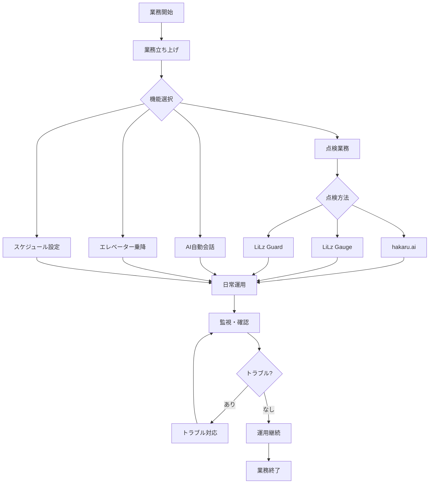
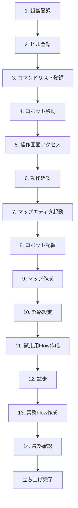
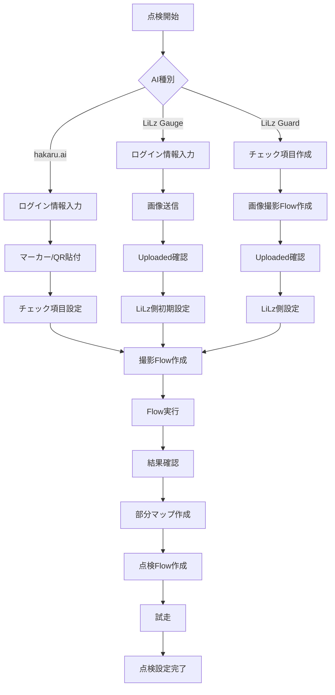
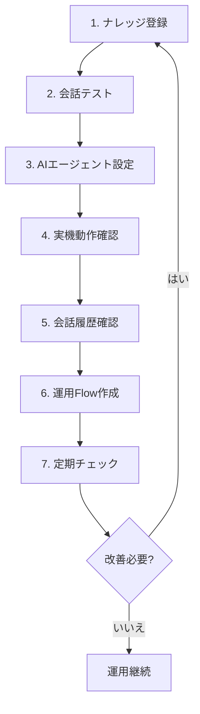
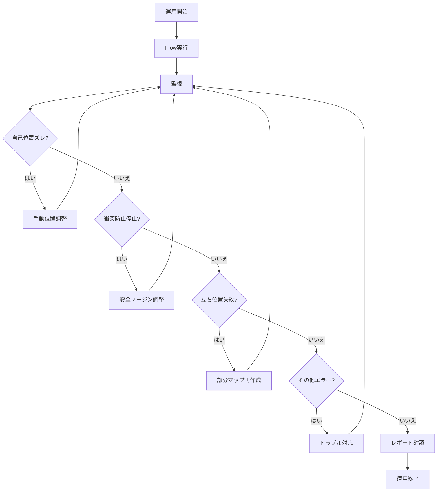

# UGO業務フロー

## 業務フロー全体図

## 業務立ち上げフロー詳細

## 点検業務フロー詳細

## AI自動会話フロー詳細

## 日常運用フロー詳細

## 目次
- [業務立ち上げ時](#業務立ち上げ時)
- [mini 点検 hakaru.ai](#mini-点検-hakaruai)
- [mini 点検 LiLz Gauge](#mini-点検-lilz-gauge)
- [異常検知AI LiLz Guard](#異常検知ai-lilz-guard)
- [AI自動会話](#ai自動会話)
- [エレベーター乗り降り](#エレベーター乗り降り)
- [スケジュール機能](#スケジュール機能)
- [日常運用時](#日常運用時)

---

## 業務立ち上げ時

### 1. 組織管理で顧客の組織を登録する
- 名前
- 郵便番号
- 住所

### 2. ビル管理でビルを登録する
- 名前
- 住所
- フロア
- ロボットグループ
- Flowグループ

### 3. コマンドリストに基本的なコマンドを登録する
- 社内環境のコマンドを定義Jsonコピー
- コマンドピッカーから適宜追加

### 4. ロボットを顧客の組織、ビルに移動する

### 5. 操作画面にアクセス

### 6. 操作画面を見ながら動作確認を行う
- キーボード操作
- リフター/テレスコピックポール操作

**確認ポイント:**
- LiDAR情報
- 衝突防止機能の検知有無

### 7. マップエディタv1を開く

### 8. マップエディタ左下からロボットをキャンバスの中央に動かす

### 9. マップ作成開始
**注意点:**
- 機体を手押しでマップを作成すると綺麗に撮れない事が多い
- miniは物理的に手で押せない
- ごく小規模な現場以外では基本的にはキーボード操作で記録する
- キーボード操作をするために操作画面も開かないといけない
- ブラウザでマップエディタと2画面表示させる

### 10. マップ完成後、経路を敷く、エリア設定
- 最近は経路指定移動、目的地指定移動での建て付けが増えてきた
- マップエディタ画面で作成する

### 11. 試走用Flowを作成する
以下のコマンドのみを含むFlowを作成:
- マップ巡回位置初期化
- マップ巡回開始/経路指定移動/目的地指定移動

### 12. 操作画面とマップエディタ2画面の状態で試走する
**確認ポイント:**
- 自己位置ズレが起きていないか
- LiDAR情報とマップ形状が正確に重なっているか
- 2画面は必須

### 13. 実際の業務で使用するFlowを作成

### 14. 全体通しで試走、完成

---

## mini 点検 hakaru.ai

### 1. ビル管理でメーター読み取りAIのログイン情報を入力する

### 2. チェック項目設定を行う
- hakaru.aiではメーター周囲にマーカー/QRコードを貼り付け
- 操作画面でチェック項目設定を行う
  - マーカーの番号
  - メーターの種類

### 3. メーター撮影FlowをFlow作成画面で作る

### 4. 操作画面でFlowを実行

### 5. レポート画面で結果を確認

### 6. 部分マップを作成
- マップエディタ > 部分マップ を開く
- 部分マップ作成

### 7. 走行も含めた点検Flowを作成
- 部分マップも組み込む

### 8. 点検も含めて操作画面からFlowを実行、試走する

---

## mini 点検 LiLz Gauge

### 1. ビル管理でメーター読み取りAIのログイン情報を入力する

### 2. チェック項目設定のSTEPに従う
- LiLz側に画像を送信
- LiLz側で初期設定を行う

### 3. レポート画面でUploadedになっていることを確認

### 4. LiLz側でメーターの初期設定

### 5. メーター撮影FlowをFlow作成画面で作る

### 6. 操作画面でFlowを実行

### 7. レポート画面で結果を確認

### 8. 部分マップを作成
- マップエディタ > 部分マップ を開く
- 部分マップ作成

### 9. 走行も含めた点検Flowを作成
- 部分マップも組み込む

### 10. 点検も含めて操作画面からFlowを実行、試走する

---

## 異常検知AI　LiLz Guard

### 1. チェック項目を作成する
- LiLz Guardではチェック項目設定のSTEPが存在しない
- グローバルメニュー「チェック項目」からチェック項目を作成する

### 2. Flow作成画面で画像撮影Flowを作成する
- LiLz側に画像を送る画像撮影Flowを作成

### 3. レポート画面でUploadedになっていることを確認

### 4. LiLz側で異常検知の設定

### 5. メーター撮影FlowをFlow作成画面で作る

### 6. 操作画面でFlowを実行

### 7. LiLz側で結果を確認

### 8. 部分マップを作成
- マップエディタ > 部分マップ を開く
- 部分マップ作成

### 9. 走行も含めた点検Flowを作成
- 部分マップも組み込む

### 10. 点検も含めて操作画面からFlowを実行、試走する

---

## AI自動会話

### 1. ナレッジ登録
- ナレッジを登録
- サイネージ使用の場合は画像も登録

### 2. 会話テスト画面で会話テストを行う

### 3. AIエージェント設定でツールと追加の指示を設定する

### 4. 自動会話ONにして実機で動作確認する

### 5. 会話履歴画面で正しく答えられたか確認する

### 6. AI自動会話を運用するFlowを作成する

### 7. 会話履歴を定期的にチェック
- 必要に応じてナレッジや追加の指示の見直しを行う

---

## エレベーター乗り降り

### 1. WorkPlanを作成する
**注意点:**
- ELV乗降WorkPlanはテンプレートも用意されている
- 実態に合っていないので使わないCSメンバーが多い

### 2. 部分マップを作成する
**注意点:**
- 現場によっては通常のマップを使ってELVに乗り込む場合もある

---

## スケジュール機能

ugoを導入する顧客は省力化を実現したいため、基本的にスケジュール機能を使用する

### スケジュール登録
- スケジュール画面でFlowをスケジュール登録する

### 開始位置保証を使って上書き実行させる場合
- 操作画面 > 設定 > 開始位置保証画像を撮影する手順が追加される

---

## 日常運用時

### Flow実行
- 操作画面にアクセスし、Flowを実行する

### 監視
- 巡回中は操作画面上のミニマップでコストマップを確認
- マップエディタと2画面で監視

### 自己位置ズレ対応
- ugoの自己位置ズレが発生した場合、手動で戻す操作が発生する

### 自動案内確認
- 会話履歴で以下を確認:
  - 会話の要約
  - スコア
  - ハルシネーション

### エラー対応
- アクティビティレポート・ヘルスチェック > エラー発生時にログを確認
**問題点:**
- アクティビティレポートの「エラー」にはエラーコード、エラー原因等の情報が一切ない
- ユーザーには不親切

### レポート確認
- メーター読み取り、写真撮影 > レポートを確認
- レポート一覧で「異常」とラベリングされている場合:
  - チェック項目などの設定を確認する

### トラブルシューティング

#### 立ち位置調整の失敗
- 部分マップの再作成

#### マップ巡回中に自己位置ズレ
- マップの再作成
- 部分的なマップ合成

#### マップ巡回中に衝突防止機能で止まる
- Flow設定で安全マージンを狭める

#### Flowの微調整
- Flow編集画面から行う

#### 経路/目的地の微調整
- マップエディタから行う
