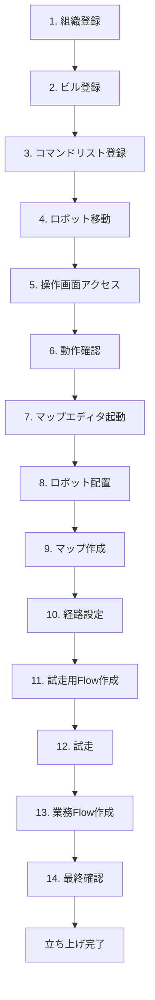

# 業務立ち上げフロー

## フローチャート

---

## 1. 組織管理で顧客の組織を登録する
- 名前
- 郵便番号
- 住所

## 2. ビル管理でビルを登録する
- 名前
- 住所
- フロア
- ロボットグループ
- Flowグループ

## 3. コマンドリストに基本的なコマンドを登録する
- 社内環境のコマンドを定義Jsonコピー
- コマンドピッカーから適宜追加

## 4. ロボットを顧客の組織、ビルに移動する

## 5. 操作画面にアクセス

## 6. 操作画面を見ながら動作確認を行う
- キーボード操作
- リフター/テレスコピックポール操作

**確認ポイント:**
- LiDAR情報
- 衝突防止機能の検知有無

## 7. マップエディタv1を開く

## 8. マップエディタ左下からロボットをキャンバスの中央に動かす

## 9. マップ作成開始
**注意点:**
- 機体を手押しでマップを作成すると綺麗に撮れない事が多い
- miniは物理的に手で押せない
- ごく小規模な現場以外では基本的にはキーボード操作で記録する
- キーボード操作をするために操作画面も開かないといけない
- ブラウザでマップエディタと2画面表示させる

## 10. マップ完成後、経路を敷く、エリア設定
- 最近は経路指定移動、目的地指定移動での建て付けが増えてきた
- マップエディタ画面で作成する

## 11. 試走用Flowを作成する
以下のコマンドのみを含むFlowを作成:
- マップ巡回位置初期化
- マップ巡回開始/経路指定移動/目的地指定移動

## 12. 操作画面とマップエディタ2画面の状態で試走する
**確認ポイント:**
- 自己位置ズレが起きていないか
- LiDAR情報とマップ形状が正確に重なっているか
- 2画面は必須

## 13. 実際の業務で使用するFlowを作成

## 14. 全体通しで試走、完成
